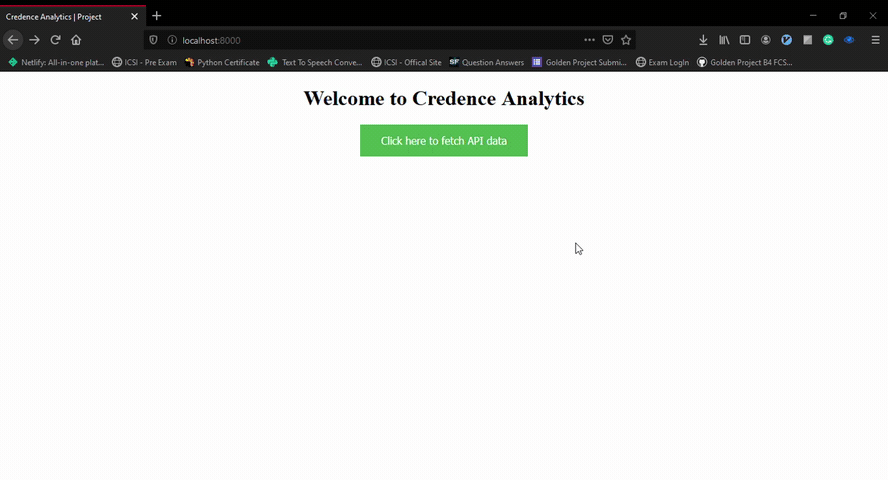

# Credence-Analytics

A project based on Node.js. It calls an API in backend, collects the data from that API and display the data into frontend. Also it provides the functionality to download the result(HTML).

## Requirements

For development, you will only need Node.js and a node global package, Yarn or npm installed in your environement.

### Node
- #### Node installation on Windows

  Just go on [official Node.js website](https://nodejs.org/) and download the installer.
Also, be sure to have `git` available in your PATH, `npm` might need it (You can find git [here](https://git-scm.com/)).

- #### Node installation on Ubuntu

  You can install nodejs and npm easily with apt install, just run the following commands.

      $ sudo apt install nodejs
      $ sudo apt install npm

- #### Other Operating Systems
  You can find more information about the installation on the [official Node.js website](https://nodejs.org/) and the [official NPM website](https://npmjs.org/).

If the installation was successful, you should be able to run the following command.

    $ node --version
    v14.6.0

    $ npm --version
    6.14.4

If you need to update `npm`, you can make it using `npm`! After running the following command, just open again the command line.

    $ npm install npm -g

## Install

    $ git clone https://github.com/sumityadav22/Credence-Analytics.git
    $ cd Credence-Analytics
    $ cd credence
    $ npm install

## Running the project

    $ node index.js

### This is how the project will look after cloning this repository
> 